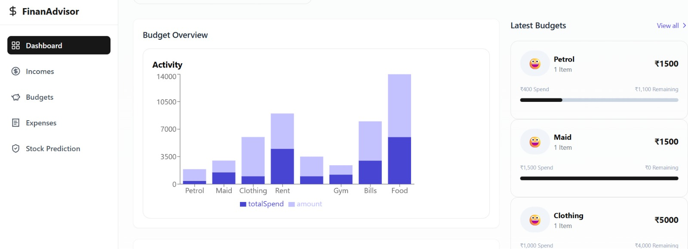

# 💰 FinWise – Your AI Financial Advisor

FinWise is a **full-stack AI-powered personal finance manager** that helps you **track expenses, visualize budgets, predict stock prices, and receive personalized investment advice**.  
It combines **Next.js** for the frontend, **FastAPI** for AI & ML-powered backend services, and the **OpenRouter API (DeepSeek)** for financial recommendations.

---

## 🚀 Features

### 📊 Smart Expense & Budget Tracking
- Manage **incomes, expenses, and budgets**
- Stored and handled via **Next.js API routes**
- **Visual dashboards** with bar graphs, emojis, and progress loaders

### 🤖 AI-Powered Financial Advice
- Personalized recommendations based on spending habits
- Uses **OpenRouter API** with **DeepSeek model** for insights

### 📈 Stock Prediction & Investment Advice
- Predicts **30 days of stock prices** using an **LSTM model**
- Works for popular tickers like AAPL, MSFT, TSLA, etc.
- AI-generated investment advice based on predictions

### 💳 Google Pay Transactions Parsing
- Upload your **Google Pay statement**
- Automatically extracts and filters transactions

---

## 🛠 Tech Stack

**Frontend**
- Next.js (React + API Routes)
- Tailwind CSS
- Chart.js / Recharts

**Backend**
- FastAPI
- yfinance (stock data)
- BeautifulSoup4 (HTML parsing)
- MinMaxScaler, Keras, TensorFlow (LSTM model)
- httpx (API calls)

**AI Integration**
- OpenRouter API
- DeepSeek Model

---

## 📦 Installation

### 1️⃣ Clone the Repository
```bash
git clone https://github.com/yourusername/finwise.git
cd finwise
npm install

cd backend
pip install fastapi uvicorn python-dotenv yfinance numpy pandas scikit-learn keras tensorflow httpx beautifulsoup4

Create a .env file inside backend/:
OPENROUTER_API_KEY=your_api_key_here
DB_URL
Run the backend:
uvicorn main:app --reload

Frontend Setup (Next.js)
cd frontend
npm install
Run the frontend:
npm run dev

```

# 📸 Screenshots

### Landing Page


### Dashboard Page




### Stock Prediction and Advice Page


## Google TakeOut Integration Page


